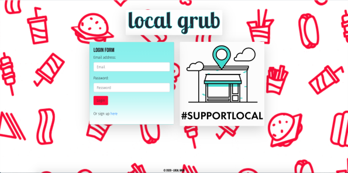
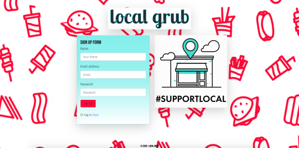
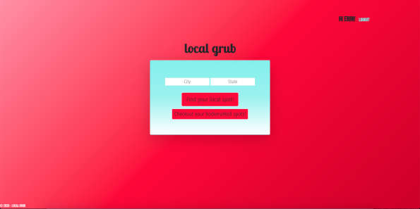
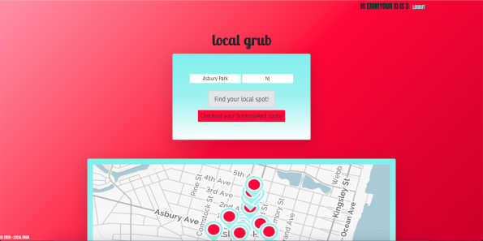
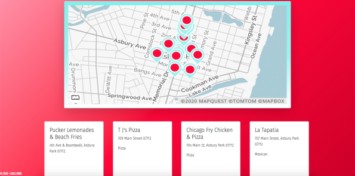
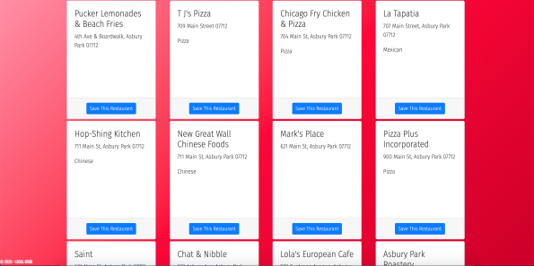
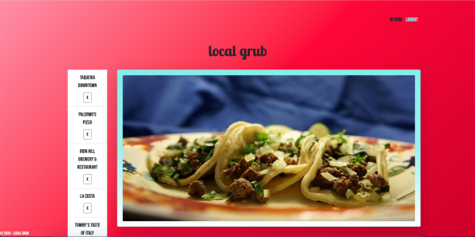
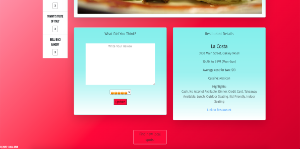

# Local Grub
# 

## TABLE OF CONTENTS
- [DESCRIPTION](#DESCRIPTION)  
- [LICENSE](#LICENSE)  
- [INSTALLATION](#INSTALLATION)  
- [TECHNOLOGIES](#TECHNOLOGIES)  
- [QUESTIONS](#QUESTIONS)  
- [CONTRIBUTIONS](#CONTRIBUTIONS)
- [LINKS](#LINKS)  
- [SCREENSHOTS](#SCREENSHOTS)  

## DESCRIPTION
Local Grub is an app that utilizes the Zomato & MapQuest API to gather local restaurant information based off of the user's city choice. This app was created to help promote small business throughout local communities, and give users that chance to explore restaurants besides the big chains/franchises. 

## LICENSE
Unlicensed

## INSTALLATION
- Install Chrome extension:
    - Allow CORS: Access-Control-Allow-origin
- Run "npm i" in command line to download dependencies. 

## TECHNOLOGIES
- HTML  
- CSS  
    - Bootstrap  
- JavaScript  
    - Node  
    - Express  
    - Sequelize  
    - Passport  
    - Axios  
- MySQL  
- [Zomato API](https://developers.zomato.com/api)  
- [MapQuest API](https://developer.mapquest.com/documentation/)  

## QUESTIONS
If you have any questions about this repository, please feel free to reach out to any of the team members (listed below). 

## CONTRIBUTIONS
Team:  
[Jonghyun Kang](https://github.com/misterjaykay)  
[Erin Platvoet](https://github.com/eplatvoet)  
[Kristen Van Neste](https://github.com/kmvanneste)  
[Andie Wheeler](https://github.com/hihellos)  

## LINKS
[HEROKU](https://localgrub.herokuapp.com/)  
[GITHUB REPO](https://github.com/eplatvoet/localgrub)  

## SCREENSHOTS
  
  
  
  
  
  
  
  
  
